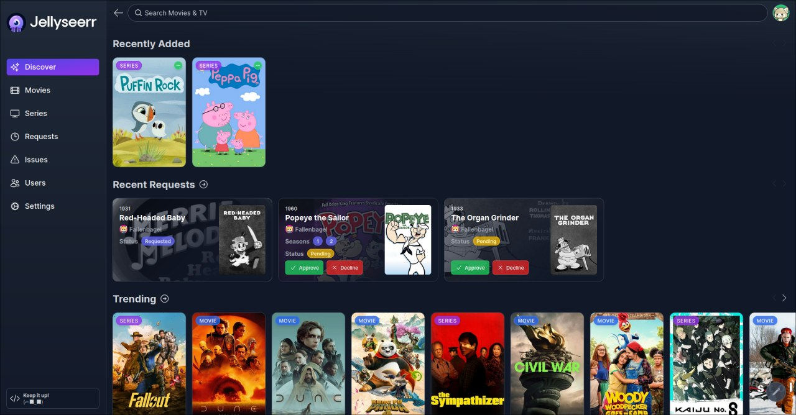

<p align="center">

</p>
<p align="center">
<a href="https://discord.gg/ckbvBtDJgC"></a>
<a href="https://hub.docker.com/r/fallenbagel/jellyseerr"></a>
<a href="https://github.com/fallenbagel/jellyseerr/blob/develop/LICENSE"></a>
</p>

**Jellyseerr** is a free and open source software application for managing requests for your media library. It is a a fork of Overseerr built to bring support for Jellyfin & Emby media servers!

_The original Overseerr team have been busy and Jellyfin/Emby support aren't on their roadmap, so we started this project as we wanted to bring the Overseerr experience to the Jellyfin/Emby Community!_

## Current Features

- Jellyfin Support
- Emby Support

  (Upcoming Features include: Multiple Server Instances, Music Support, Ability to change email address and much more!)

Along with all the existing Overseerr features:

- Full Plex integration. Authenticate and manage user access with Plex!
- Easy integration with your existing services. Currently, Jellyseerr supports Sonarr and Radarr. More to come!
- Plex library scan, to keep track of the titles which are already available.
- Customizable request system, which allows users to request individual seasons or movies in a friendly, easy-to-use interface.
- Incredibly simple request management UI. Don't dig through the app to simply approve recent requests!
- Granular permission system.
- Support for various notification agents.
- Mobile-friendly design, for when you need to approve requests on the go!

With more features on the way! Check out our [issue tracker](https://github.com/fallenbagel/jellyseerr/issues) to see the features which have already been requested.

## Getting Started

Check out our dockerhub for instructions on how to install and run Jellyseerr:
https://hub.docker.com/r/fallenbagel/jellyseerr

### Launching Jellyseerr manually:

```bash
yarn install
yarn run build
yarn start
```

### Packages:

Archlinux: [AUR](https://aur.archlinux.org/packages/jellyseerr)

## Preview



## Support

- You can get support on [Discord](https://discord.gg/ckbvBtDJgC).
- You can ask questions in the Help category of our [GitHub Discussions](https://github.com/fallenbagel/jellyseerr/discussions).
- Bug reports and feature requests can be submitted via [GitHub Issues](https://github.com/fallenbagel/jellyseerr/issues).

## API Documentation

You can access the API documentation from your local Jellyseerr install at http://localhost:5055/api-docs

## Community

You can ask questions, share ideas, and more in [GitHub Discussions](https://github.com/fallenbagel/jellyseerr/discussions).

If you would like to chat with other members of our growing community, [join the Jellyseerr Discord server](https://discord.gg/ckbvBtDJgC)!

Our [Code of Conduct](https://github.com/fallenbagel/jellyseerr/blob/develop/CODE_OF_CONDUCT.md) applies to all Jellyseerr community channels.

## Contributing

You can help improve Jellyseerr too! Check out our [Contribution Guide](https://github.com/fallenbagel/jellyseerr/blob/develop/CONTRIBUTING.md) to get started.
